# Quick start

## Install in Blender

Clone the repository (or download it as a ZIP from GitHub and unpack it):

```sh
git clone https://github.com/mmaciejak/Blendmentation
```

Then, in Blender's Scripting tab, add the cloned folder (the one that contains
`blendmentation/`) to `sys.path`. All the examples below start with these lines:

```python
import sys
sys.path.append("/path/to/Blendmentation")  # the cloned folder

import bpy
from blendmentation.augmentations import augmentations as aug
from blendmentation.export import export
from blendmentation.generating import generating as gen
from blendmentation.state import state
```

To install it with pip, or to use Blender as a Python module, see
[Installation](installation.md).

## Chained transform augmentations

The scene has a milk carton "Milk Box" standing on a floor "Floor", with its rotation
at (0, 0, 0).

The most basic augmentations are transforms. You can create a `Compose` with them like
this. Here a milk carton standing on its base gets a random heading and position.

```python
milk_box = bpy.data.objects["Milk Box"]

# standing on its base: any heading, moved on the floor
standing_aug = aug.Compose([
    aug.Rotation(z=180),
    aug.Translation(x=0.5, y=0.5),
])
```

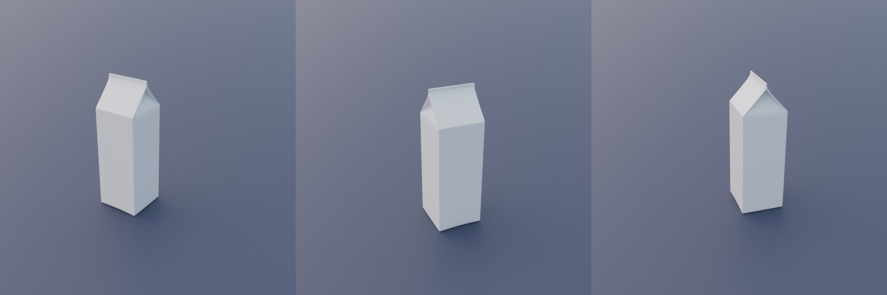{ .full-width }

You can also control the chance of the whole `Compose` happening with `p`.

```python hl_lines="7"
milk_box = bpy.data.objects["Milk Box"]

# standing on its base: any heading, moved on the floor
standing_aug = aug.Compose([
    aug.Rotation(z=180),
    aug.Translation(x=0.5, y=0.5),
], p=0.8)
```

Let's imagine that in our case we want about 80% of the datapoints with the milk carton
standing up, and about 20% with it lying on its side. Here is a second `Compose` for
that. A single `Rotation` tips the carton over around X and picks the side it lies on
with a stepped Y rotation, which turns it around its long axis. `PlaceOn`, after the
transforms, moves it up or down until it rests on the floor, wherever its origin is.

```python hl_lines="2 10-18"
milk_box = bpy.data.objects["Milk Box"]
floor = bpy.data.objects["Floor"]

# standing on its base: any heading, moved on the floor
standing_aug = aug.Compose([
    aug.Rotation(z=180),
    aug.Translation(x=0.5, y=0.5),
], p=0.8)

# lying on one of its four sides
lying_aug = aug.Compose([
    # tipped over around X, turned around its long axis in 90 degree
    # steps (which side is down), any heading
    aug.Rotation(x=(90, 90), y=(0, 270, 90), z=180),
    aug.Translation(x=0.5, y=0.5),
    # after the transforms: sets it down on the floor
    aug.PlaceOn(floor),
])
```

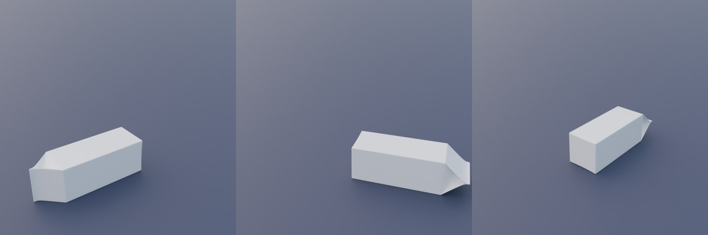{ .full-width }

Then add a generating `Compose` with simple bounding boxes, and `BBoxImage`, a copy of
the image with the boxes drawn on it.

```python hl_lines="20-29"
milk_box = bpy.data.objects["Milk Box"]
floor = bpy.data.objects["Floor"]

# standing on its base: any heading, moved on the floor
standing_aug = aug.Compose([
    aug.Rotation(z=180),
    aug.Translation(x=0.5, y=0.5),
], p=0.8)

# lying on one of its four sides
lying_aug = aug.Compose([
    # tipped over around X, turned around its long axis in 90 degree
    # steps (which side is down), any heading
    aug.Rotation(x=(90, 90), y=(0, 270, 90), z=180),
    aug.Translation(x=0.5, y=0.5),
    # after the transforms: sets it down on the floor
    aug.PlaceOn(floor),
])

generator = gen.Compose(
    [
        gen.Render(),
        gen.BBox({"milk_box": [milk_box]}),
        # a copy of the image with the boxes drawn, to check them
        gen.BBoxImage(),
    ],
    path="//dataset",
    resolution=(640, 480),
)
```

And finally, save the initial state and create the pipeline. It uses the lying-down
augmentation only when the standing one didn't happen: `applied` tells whether the last
call of a `Compose` ran.

```python hl_lines="31 33-39"
milk_box = bpy.data.objects["Milk Box"]
floor = bpy.data.objects["Floor"]

# standing on its base: any heading, moved on the floor
standing_aug = aug.Compose([
    aug.Rotation(z=180),
    aug.Translation(x=0.5, y=0.5),
], p=0.8)

# lying on one of its four sides
lying_aug = aug.Compose([
    # tipped over around X, turned around its long axis in 90 degree
    # steps (which side is down), any heading
    aug.Rotation(x=(90, 90), y=(0, 270, 90), z=180),
    aug.Translation(x=0.5, y=0.5),
    # after the transforms: sets it down on the floor
    aug.PlaceOn(floor),
])

generator = gen.Compose(
    [
        gen.Render(),
        gen.BBox({"milk_box": [milk_box]}),
        # a copy of the image with the boxes drawn, to check them
        gen.BBoxImage(),
    ],
    path="//dataset",
    resolution=(640, 480),
)

initial = state.State([milk_box])

for _ in range(100):
    standing_aug([milk_box])
    # the 20% where it isn't standing
    if not standing_aug.applied:
        lying_aug([milk_box])
    generator()
    initial.restore()
```

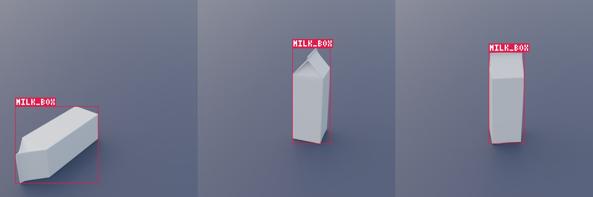{ .full-width }

## Augmenting a material with shader nodes

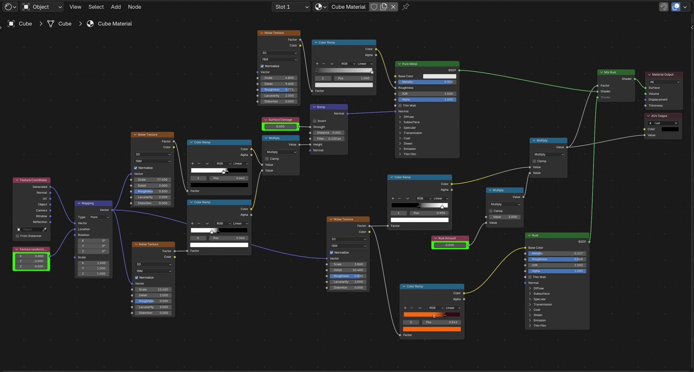

With `Vector` you can randomize a procedural material between datapoints. Here a Vector
node "Texture randomization" moves the Mapping of all the material's textures (a Vector
node in shader nodes needs Blender 5). A single number pair in `value_range` is used for
every component, so `(-100, 100)` is the same as `((-100, -100, -100), (100, 100, 100))`.

```python
material = bpy.data.materials["Cube Material"]

# the paths are relative to the material
material_aug = aug.Compose([
    # moves all textures: a random offset on each axis
    aug.Vector(
        'node_tree.nodes["Texture randomization"].vector',
        value_range=(-100, 100),
    ),
])
```

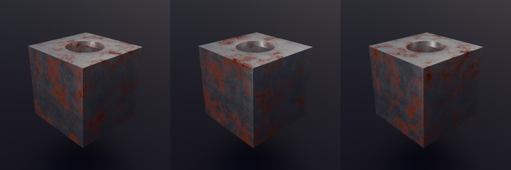{ .full-width }

Any other single value, such as a Value node, can be controlled with `Number`. Here
"Surface Damage" sets the bump strength.

```python hl_lines="10-14"
material = bpy.data.materials["Cube Material"]

# the paths are relative to the material
material_aug = aug.Compose([
    # moves all textures: a random offset on each axis
    aug.Vector(
        'node_tree.nodes["Texture randomization"].vector',
        value_range=(-100, 100),
    ),
    # bump strength
    aug.Number(
        'node_tree.nodes["Surface Damage"].outputs[0].default_value',
        value_range=(0, 1),
    ),
])
```

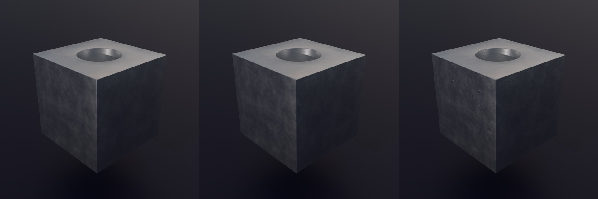{ .full-width }

With `p` you control the probability of an augmentation, here how often rust appears
in the dataset. `otherwise` is the value set the rest of the time, here no rust; without
it the value stays as it is.

```python hl_lines="15-21"
material = bpy.data.materials["Cube Material"]

# the paths are relative to the material
material_aug = aug.Compose([
    # moves all textures: a random offset on each axis
    aug.Vector(
        'node_tree.nodes["Texture randomization"].vector',
        value_range=(-100, 100),
    ),
    # bump strength
    aug.Number(
        'node_tree.nodes["Surface Damage"].outputs[0].default_value',
        value_range=(0, 1),
    ),
    # rust in 20% of the images, clearly visible; none in the others
    aug.Number(
        'node_tree.nodes["Rust Amount"].outputs[0].default_value',
        value_range=(0.5, 1),
        p=0.2,
        otherwise=0,
    ),
])
```

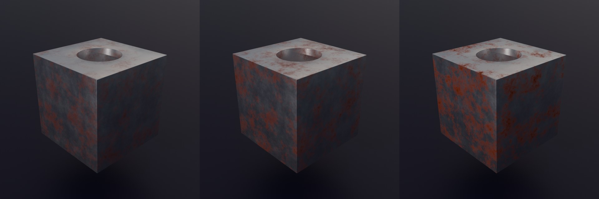{ .full-width }

To render the images, and a mask of the rust we just added, we can use a setup like
this. The rust factor goes to an AOV Output "rust" (Value), and a Value AOV "rust" is
added in View Layer Properties → Passes → Shader AOV. The engine is Cycles or EEVEE.

```python hl_lines="23-31"
material = bpy.data.materials["Cube Material"]

# the paths are relative to the material
material_aug = aug.Compose([
    # moves all textures: a random offset on each axis
    aug.Vector(
        'node_tree.nodes["Texture randomization"].vector',
        value_range=(-100, 100),
    ),
    # bump strength
    aug.Number(
        'node_tree.nodes["Surface Damage"].outputs[0].default_value',
        value_range=(0, 1),
    ),
    # rust in 20% of the images, clearly visible; none in the others
    aug.Number(
        'node_tree.nodes["Rust Amount"].outputs[0].default_value',
        value_range=(0.5, 1),
        p=0.2,
        otherwise=0,
    ),
])
generator = gen.Compose(
    [
        gen.Render(),
        # the rust mask; no file when there is no rust
        gen.AOVToImage(["rust"], skip_empty=True),
    ],
    path="//dataset",
    resolution=(640, 480),
)
```

Before we start generating, it is a good idea to save the state of the material, so it
can be restored after every augmentation.

```python hl_lines="32-33"
material = bpy.data.materials["Cube Material"]

# the paths are relative to the material
material_aug = aug.Compose([
    # moves all textures: a random offset on each axis
    aug.Vector(
        'node_tree.nodes["Texture randomization"].vector',
        value_range=(-100, 100),
    ),
    # bump strength
    aug.Number(
        'node_tree.nodes["Surface Damage"].outputs[0].default_value',
        value_range=(0, 1),
    ),
    # rust in 20% of the images, clearly visible; none in the others
    aug.Number(
        'node_tree.nodes["Rust Amount"].outputs[0].default_value',
        value_range=(0.5, 1),
        p=0.2,
        otherwise=0,
    ),
])
generator = gen.Compose(
    [
        gen.Render(),
        # the rust mask; no file when there is no rust
        gen.AOVToImage(["rust"], skip_empty=True),
    ],
    path="//dataset",
    resolution=(640, 480),
)
# saves the whole material: node values and settings
initial = state.State([material])
```

And now we can generate the images with the rust masks. The label lists each mask under
`"aovs"`, and `None` for the images without rust.

```python hl_lines="35-38"
material = bpy.data.materials["Cube Material"]

# the paths are relative to the material
material_aug = aug.Compose([
    # moves all textures: a random offset on each axis
    aug.Vector(
        'node_tree.nodes["Texture randomization"].vector',
        value_range=(-100, 100),
    ),
    # bump strength
    aug.Number(
        'node_tree.nodes["Surface Damage"].outputs[0].default_value',
        value_range=(0, 1),
    ),
    # rust in 20% of the images, clearly visible; none in the others
    aug.Number(
        'node_tree.nodes["Rust Amount"].outputs[0].default_value',
        value_range=(0.5, 1),
        p=0.2,
        otherwise=0,
    ),
])
generator = gen.Compose(
    [
        gen.Render(),
        # the rust mask; no file when there is no rust
        gen.AOVToImage(["rust"], skip_empty=True),
    ],
    path="//dataset",
    resolution=(640, 480),
)
# saves the whole material: node values and settings
initial = state.State([material])

for _ in range(100):
    material_aug([material])
    generator()
    initial.restore()
```

## A smart material

A smart material puts its settings on one group node, here "Ferrous metal" in the
material "Master material". `SmartMaterial` sets many of its inputs in one augmentation:
each input gets a range, or an `Input` with its own `p` and `otherwise`. Inputs are set like
`Number`, `Vector`, `Boolean` or `Menu`, by their socket type, and a color range keeps
alpha. The menus here need Blender 5.

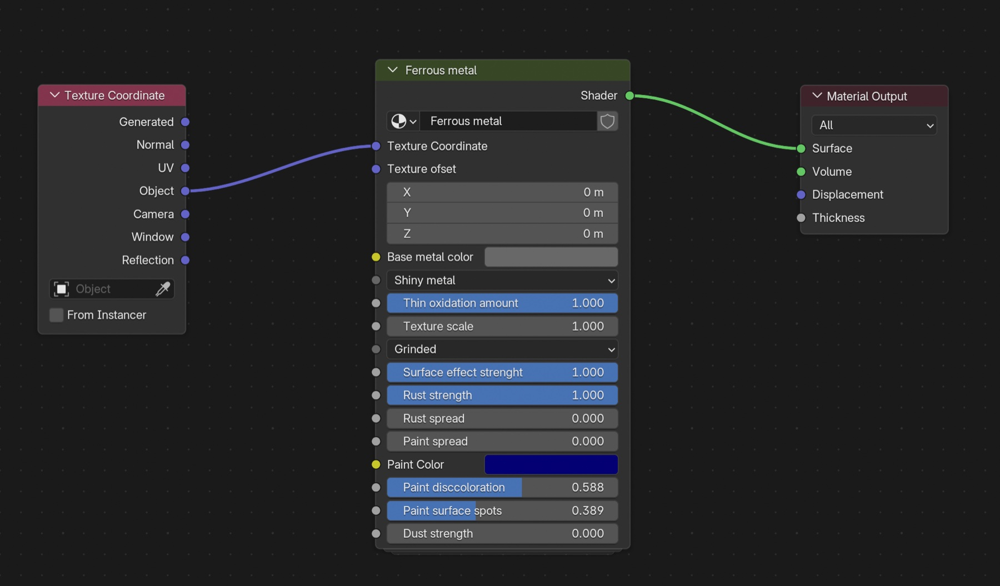

```python
ferrous_metal = aug.SmartMaterial(
    'bpy.data.materials["Master material"].node_tree.nodes["Ferrous metal"]',
    {
        # moves the textures: every axis
        "Texture ofset": (-100, 100),
        # any option of the menu, read from the group
        "Grinded": None,
        # 0, 0.25, ... 1: (low, high, step)
        "Rust strength": (0, 1, 0.25),
        # rust in 20% of the images, clearly visible; none in the others
        "Rust spread": aug.Input((0.5, 1), p=0.2, otherwise=0),
        # painted in half of the images
        "Paint spread": aug.Input((0.2, 0.9), p=0.5, otherwise=0),
        # any color: red, green and blue from 0 to 1
        "Paint Color": (0, 1),
    },
)
generator = gen.Compose(
    [gen.Render()],
    path="//dataset",
    resolution=(640, 480),
)
# saves the inputs it sets
initial = state.State([], fields=[ferrous_metal])

for _ in range(100):
    # an absolute path: no object needed
    ferrous_metal()
    generator()
    initial.restore()
```

The inputs are named as in the group's interface (the node shows them shortened), and
`ferrous_metal.actual` holds the value set to each. To give every object its own copy
of the material a different look, use a path relative to the object,
`'active_material.node_tree.nodes["Ferrous metal"]'`, in a `Compose` called with the
objects.

## HDRI world

A random HDRI, brightness and rotation for the world in every image. The world's nodes:
Texture Coordinate (Generated) → Mapping → three Environment Textures with the HDRIs →
a Menu Switch with the items A, B and C, one per texture → Background → World Output.
A Menu Switch in shader nodes needs Blender 5. The engine is Cycles or EEVEE.

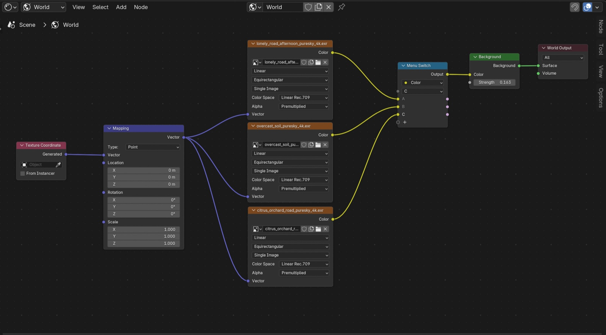

```python
world = bpy.context.scene.world

# the paths are relative to the world
world_aug = aug.Compose([
    # HDRI: A, B or C, the options are read from the node
    aug.Menu(
        'node_tree.nodes["Menu Switch"].inputs[0].default_value',
    ),
    # strength
    aug.Number(
        'node_tree.nodes["Background"].inputs[1].default_value',
        value_range=(0, 0.3),
    ),
    # rotation around Z, in radians
    aug.Number(
        'node_tree.nodes["Mapping"].inputs[2].default_value[2]',
        value_range=(0, 6.28),
    ),
])
generator = gen.Compose(
    [gen.Render()],
    path="//dataset",
    resolution=(640, 480),
)
# saves the world's node values
initial = state.State([world])

for _ in range(100):
    # a world goes where the objects usually go
    world_aug([world])
    generator()
    initial.restore()
```

`Menu` takes the options from the Menu Switch; pass `options=["A", "B", "C"]` and
`weights=[2, 1, 1]` to pick some more often. With absolute paths, as Blender's Copy Full
Data Path gives them (`'bpy.data.worlds["World"].node_tree.nodes["Background"].inputs[1].default_value'`),
the same works, and the world doesn't have to be passed to `State`:
`state.State([], fields=world_aug.augmentations)`.

## Cluttered scene with geometry nodes

For many objects, let geometry nodes build the scene and only change their seeds. Here
a geometry nodes modifier on "Floor" (node group "Geometry Nodes") displaces the floor
with a Noise Texture moved by a Random Value, scatters points on it with Distribute
Points on Faces (Poisson Disk), and puts a random object from a collection on each point
(Collection Info with Separate Children, Instance on Points with Pick Instance), then
turns each instance with another Random Value. The collection holds the milk carton
"Milk Box" and colored boxes, which are clutter and get no class.

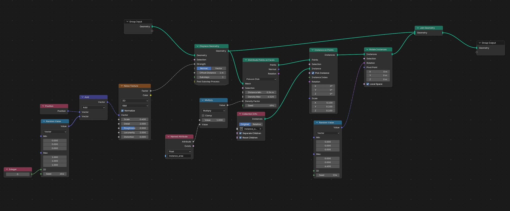

`Seed` gives every unlinked Seed input of the node group a new random value, so the
floor shape, the points and the rotations change together. `Instances` labels every milk
carton the floor's geometry nodes instance as its own instance of the class.

```python
floor = bpy.data.objects["Floor"]
milk_box = bpy.data.objects["Milk Box"]
geo_node_tree = bpy.data.node_groups["Geometry Nodes"]

# a new random value for every seed in the node group
nodes_aug = aug.Compose([aug.Seed(geo_node_tree)])

# every milk carton instanced on the floor; the colored boxes have no class
classes = {"milk_box": [gen.Instances(floor, of=milk_box)]}

generator = gen.Compose(
    [
        gen.Render(),
        gen.Segmentation(classes),
        # a copy of the image with the masks drawn, to check them
        gen.SegmentationImage(),
    ],
    path="//dataset",
    resolution=(640, 640),
)
# the node group holds the seeds
initial = state.State([floor, geo_node_tree])

for _ in range(100):
    # Seed ignores the object, so it runs once
    nodes_aug([floor])
    generator()
    initial.restore()
```

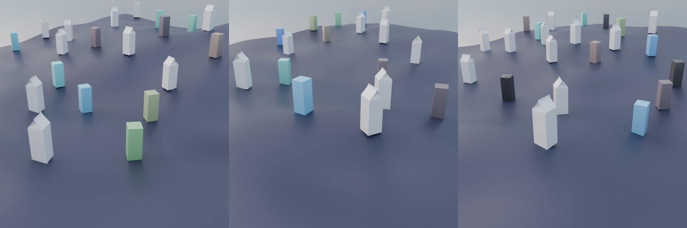{ .full-width }

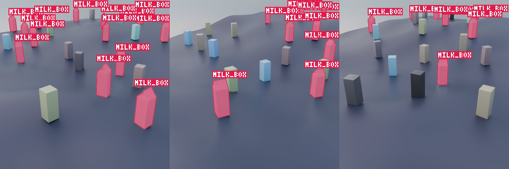{ .full-width }

## Exporting

The export functions turn the generated `<index>.json` labels into a standard format.
Each example here has only the generating steps that format needs; generate with the loop
from the sections above (augment, `generator()`, `initial.restore()`), then call the
export once on the same path. The examples use the milk carton from the first section.

### COCO

Boxes and instance masks for detection and instance segmentation. With masks, the boxes
are the extent of the visible pixels of each mask.

```python
milk_box = bpy.data.objects["Milk Box"]

generator = gen.Compose(
    [
        gen.Render(),
        gen.Segmentation({"milk_box": [milk_box]}),
    ],
    path="//dataset",
    resolution=(640, 480),
)

# ... generate ...

# writes //dataset/coco.json
export.coco("//dataset")
```

For boxes only, use `gen.BBox` in place of `gen.Segmentation`.

### YOLO

Detection boxes, a `.txt` file next to every image and a `dataset.yaml` for Ultralytics.

```python
milk_box = bpy.data.objects["Milk Box"]

generator = gen.Compose(
    [
        gen.Render(),
        gen.BBox({"milk_box": [milk_box]}),
    ],
    path="//dataset",
    resolution=(640, 480),
)

# ... generate ...

# writes //dataset/<index>.txt, classes.txt and dataset.yaml
export.yolo("//dataset")
```

`BBox` boxes are amodal: they cover the whole object, also the parts hidden behind other
objects. A milk carton half behind a box gets a box around all of it. Most detection
datasets use modal boxes instead, around only the visible pixels. For those, generate
instance masks with `Segmentation` and export with `bbox_from="mask"`: each box is then
the extent of its mask, and a fully hidden carton gets no box. `BBox` can stay, for its
skip settings (`max_truncation`, `max_occlusion`), but it isn't needed.

```python hl_lines="6 15"
milk_box = bpy.data.objects["Milk Box"]

generator = gen.Compose(
    [
        gen.Render(),
        gen.Segmentation({"milk_box": [milk_box]}),
    ],
    path="//dataset",
    resolution=(640, 480),
)

# ... generate ...

# boxes of the visible pixels, from the masks
export.yolo("//dataset", bbox_from="mask")
```

### Pascal VOC

Detection boxes, one XML file per image.

```python
milk_box = bpy.data.objects["Milk Box"]

generator = gen.Compose(
    [
        gen.Render(),
        gen.BBox({"milk_box": [milk_box]}),
    ],
    path="//dataset",
    resolution=(640, 480),
)

# ... generate ...

# writes //dataset/Annotations/<index>.xml
export.voc("//dataset")
```

For boxes of only the visible pixels, use `Segmentation` and `bbox_from="mask"` as in
the second YOLO example.

### BOP

6D poses for pose estimation. It needs the pose of every instance and the camera's
intrinsics, with a perspective camera. Every object of a class must keep the same mesh
and scale, so no `Scale` augmentation on it.

```python
milk_box = bpy.data.objects["Milk Box"]

generator = gen.Compose(
    [
        gen.Render(),
        gen.Pose({"milk_box": [milk_box]}),
        gen.CameraData(),
    ],
    path="//dataset",
    resolution=(640, 480),
)

# ... generate ...

# writes //dataset/bop/train_pbr/000000
export.bop("//dataset")
```

For the masks and visible fractions, add
`gen.Segmentation({"milk_box": [milk_box]}, full_masks=True)`; for depth images,
`gen.Passes(["Depth"])` with Cycles or EEVEE. The 3D model of each class
(`models/obj_<obj_id>.ply`, in mm) is not written; export it from Blender.

## Full example

The scene here has two cars and a table made of two objects, a plant "Plant" that is in no
class and may hide them, a floor "Floor" with pebbles scattered on it by a geometry nodes group
"Scatter" in a modifier on the floor (instances of the objects of a collection "Pebbles", from a
Collection Info node, without random scale), a point light and a camera. The cars use the material "CarPaint". The engine is Cycles or EEVEE, with a
shader AOV "Albedo" in View Layer Properties → Passes → Shader AOV. The render is transparent
(Render Properties → Film → Transparent, RGBA output), and a folder "backgrounds" with photos
is next to the .blend file.

```python
car_1 = bpy.data.objects["Car.001"]
car_2 = bpy.data.objects["Car.002"]
table = [bpy.data.objects["TableTop"], bpy.data.objects["TableLegs"]]
plant = bpy.data.objects["Plant"]
floor = bpy.data.objects["Floor"]
lamp = bpy.data.objects["Light"]
camera = bpy.context.scene.camera
scatter = bpy.data.node_groups["Scatter"]
pebbles = bpy.data.collections["Pebbles"]

# 1. augmentations, applied to every object in the list
keep_above = aug.KeepAbove(floor, margin=0.01)
objects_aug = aug.Compose([
    aug.Translation(x=0.5, y=0.5),
    aug.Rotation(z=180),
    aug.SimpleMaterial(
        "CarPaint",
        hue=(0, 1),
        saturation=(0.5, 1),
        roughness=(0.1, 0.6),
    ),
    # more inputs of the same material, each its own way
    aug.SmartMaterial(
        'active_material.node_tree.nodes["Principled BSDF"]',
        {
            # (low, high, step): 0, 0.1, ... 0.5
            "Coat Roughness": (0, 0.5, 0.1),
            # a clear coat on 30% of the cars, none on the others
            "Coat Weight": aug.Input((0.5, 1), p=0.3, otherwise=0),
        },
    ),
    # after the transforms: lifts the cars out of the floor
    keep_above,
])
lamp_aug = aug.Compose([
    # a new brightness or a new color, brightness twice as often
    aug.OneOf(
        [
            aug.Number("data.energy", value_range=(600, 1400)),
            aug.Vector("data.color", value_range=(0.8, 1.0)),
        ],
        weights=[2, 1],
    ),
    aug.Menu("data.type", options=["POINT", "SPOT"]),
    aug.Boolean("data.use_shadow", p=0.8),
])
plant_aug = aug.Compose([
    # in the render 70% of the time, labels follow
    aug.Visibility(p=0.7),
    # only half of the time; BOP needs fixed-size cars
    aug.Scale(x=10, y=10, z=10, p=0.5),
    # one of 8 headings, 45 degrees apart: (low, high, step)
    aug.Rotation(z=(0, 315, 45)),
])
# a new random value for every seed in the node group
scatter_seed = aug.Seed(scatter)
camera_aug = aug.Compose([
    aug.LookAt(
        [car_1, car_2],
        distance=(6, 12),
        elevation=(10, 45),
        azimuth=(0, 360),
    ),
    aug.FocalLength((24, 85), target=[car_1, car_2], keep_size=True),
    # blurred in half of the images, sharp in the others
    aug.DepthOfField(car_1, f_stop=(1.4, 5.6), p=0.5, otherwise=False),
])

# 2. what to save for every datapoint
classes = {
    "car": [car_1, car_2],
    # wins over the BBox argument
    "table": {"instances": [table], "max_truncation": 0.8},
    # every pebble the floor's geometry nodes scatter
    "pebble": {
        "instances": [gen.Instances(floor, of=pebbles)],
        "max_truncation": None,
        "max_occlusion": None,
    },
}
steps = [
    gen.Render(),
    # random background behind the render
    gen.Background(
        weights={
            "color": 1,
            "white_noise": 1,
            "color_noise": 1,
            "image": 2,
        },
        images_path="//backgrounds",
    ),
    gen.AOVToImage(["Albedo"]),
    gen.Passes(["Depth", "Normal"]),
    gen.BBox(
        classes,
        iou_deconflict=0.5,
        max_truncation=0.3,
        max_occlusion=0.5,
    ),
    # copy of the image with the boxes drawn, to check them
    gen.BBoxImage(),
    gen.Segmentation(
        classes,
        per="both",
        skip_empty=True,  # no file for empty masks
        full_masks=True,  # + masks ignoring occlusion, for BOP
    ),
    # copy of the image with the masks drawn
    gen.SegmentationImage(),
    gen.RotationMatrix([car_1, car_2]),
    # 6D pose of every instance, OpenCV camera axes
    gen.Pose(classes),
    gen.CameraData(),
    gen.Keypoints({"car_1": car_1, "car_1_corner": (car_1, 0)}),
    gen.OutputField("light_energy", 'bpy.data.lights["Light"].energy'),
]
generator = gen.Compose(steps, path="//dataset", resolution=(640, 480))

# 3. the scene state to go back to after every datapoint
initial = state.State(
    [car_1, car_2, plant, lamp, camera, scatter],
    fields=objects_aug.augmentations + lamp_aug.augmentations,
)

for _ in range(1000):
    objects_aug([car_1, car_2])
    # the whole Compose 70% of the time
    lamp_aug([lamp], p=0.7)
    plant_aug([plant])
    camera_aug([camera])
    scatter_seed()
    # extra label key: how far each car was lifted
    generator({"lift": keep_above.results})
    initial.restore()

# 4. training-ready annotations
export.coco("//dataset")
# boxes of the visible pixels, from the masks
export.yolo("//dataset", bbox_from="mask")
# 6D pose: poses, masks, depth
export.bop("//dataset")
```
